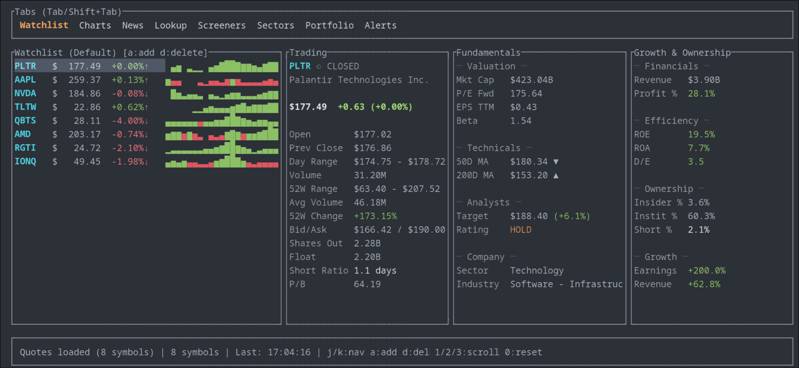
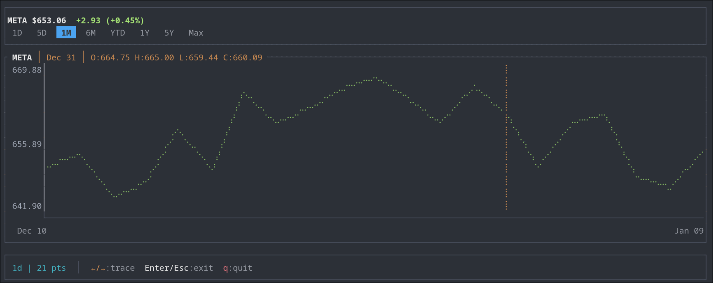
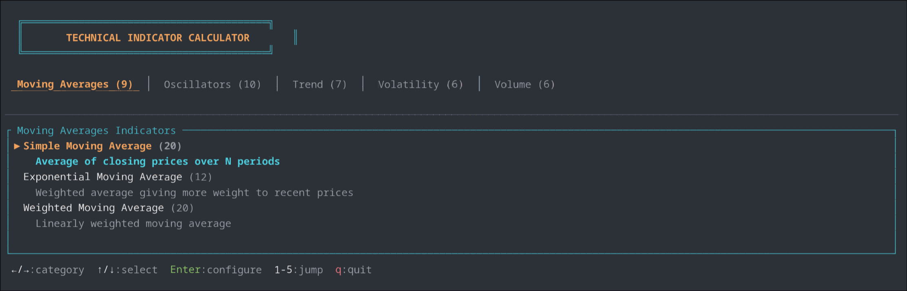
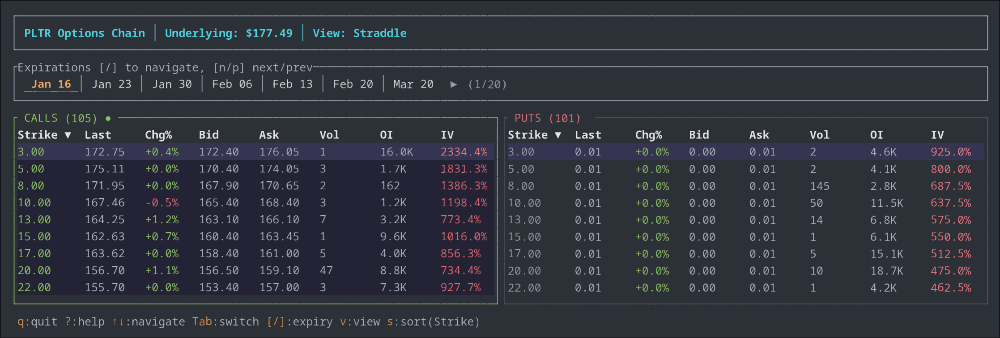
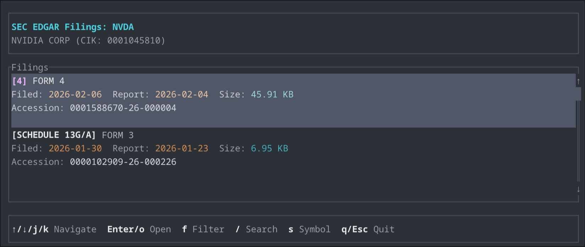

# fq - Finance Query CLI

[](https://github.com/Verdenroz/finance-query/releases)
[](https://opensource.org/licenses/MIT)

Command-line tool for financial data. Supports stocks, ETFs, crypto, currencies, and indices.

Built on the [finance-query](https://crates.io/crates/finance-query) library.



## Install

**Pre-built binaries** (recommended):

```bash
# Linux/macOS
curl --proto '=https' --tlsv1.2 -LsSf https://github.com/Verdenroz/finance-query/releases/latest/download/finance-query-cli-installer.sh | sh

# Windows
powershell -c "irm https://github.com/Verdenroz/finance-query/releases/latest/download/finance-query-cli-installer.ps1 | iex"
```

**From crates.io:**

```bash
cargo install finance-query-cli
```

**From source:**

```bash
git clone https://github.com/Verdenroz/finance-query
cd finance-query/finance-query-cli
cargo install --path .
```

## Quick Start

```bash
# Get a quote
fq quote AAPL

# Multiple symbols
fq quote AAPL MSFT GOOGL TSLA

# Live streaming prices
fq stream AAPL TSLA NVDA

# Interactive dashboard
fq dashboard
```

## Commands

Run `fq --help` for the full list, or `fq <command> --help` for details on any command.

### Market Data

| Command | Description |
|---------|-------------|
| `quote` | Current price, volume, change, and key metrics |
| `chart` | Historical OHLCV data with interactive TUI |
| `stream` | Real-time price updates via WebSocket |
| `market` | Market summary (indices, futures, bonds, crypto) |
| `trending` | Trending symbols by region |
| `indices` | World market indices |
| `sector` | Sector performance and top movers |
| `screener` | Pre-built screeners (gainers, losers, most active) |

### Company Information

| Command | Description |
|---------|-------------|
| `info` | Full company details (profile, stats, financials) |
| `profile` | Company description, sector, industry, employees |
| `financials` | Income statement, balance sheet, cash flow |
| `earnings` | Earnings history and estimates |
| `news` | Recent news articles |
| `recommendations` | Analyst buy/hold/sell ratings |
| `holders` | Institutional and insider ownership |
| `edgar` | Interactive SEC EDGAR filings browser (TUI) |
| `facts` | Structured XBRL financial data from EDGAR |
| `transcript` | Earnings call transcripts |
| `grades` | Analyst upgrade/downgrade history |

### Technical Analysis

| Command | Description |
|---------|-------------|
| `indicator` | 40+ indicators (RSI, MACD, SMA, Bollinger, etc.) |
| `backtest` | Test trading strategies with performance metrics |

### Options & Dividends

| Command | Description |
|---------|-------------|
| `options` | Interactive options chain explorer |
| `dividends` | Dividend payment history |
| `splits` | Stock split history |

### Utilities

| Command | Description |
|---------|-------------|
| `lookup` | Search symbols by name or keyword |
| `hours` | Market hours and trading status |
| `currencies` | Currency list and exchange rates |
| `exchanges` | Supported exchanges |
| `alerts` | Price alerts with desktop notifications |
| `dashboard` | Interactive market dashboard |

## Output Formats

All commands support multiple output formats:

```bash
fq quote AAPL -o table    # Pretty table (default)
fq quote AAPL -o json     # JSON
fq quote AAPL -o csv      # CSV for spreadsheets
```

Export to file:

```bash
fq chart AAPL -r 1y -o csv > aapl_2024.csv
```

## Configuration

### EDGAR Email Persistence

EDGAR commands require a contact email. Provide it once with `--email` (or `EDGAR_EMAIL`),
and `fq` will persist it to `~/.config/fq/config.json` and reuse it automatically.

```bash
# First run: set and persist
fq edgar --email you@example.com

# Next runs: no email needed
fq edgar
fq facts AAPL
```

## Examples

### Quotes

```bash
# Basic quote
fq quote AAPL

# Compare multiple stocks
fq quote AAPL MSFT GOOGL AMZN META -o table

# Crypto and forex
fq quote BTC-USD ETH-USD EURUSD=X
```

### Charts

```bash
# Interactive chart (TUI)
fq chart AAPL

# Specify interval and range
fq chart AAPL -i 1d -r 6mo

# Export as table
fq chart AAPL -r 1mo -o csv
```



### Technical Indicators

```bash
# Interactive TUI (select indicators interactively)
fq indicator AAPL

# Single indicator (non-interactive)
fq indicator AAPL --indicator rsi:14 --no-tui

# Multiple indicators (run separately)
fq indicator AAPL --indicator sma:20,50,200 --no-tui

# Available indicators: sma, ema, rsi, macd, bollinger, atr,
# stochastic, adx, obv, vwap, cci, williamsr, stochrsi, psar,
# supertrend, mfi, ichimoku, donchian
```



### Backtesting

```bash
# Interactive backtest (TUI)
fq backtest AAPL

# With preset strategy
fq backtest AAPL --preset swing
fq backtest AAPL --preset trend

# Available presets: swing, day, trend, mean-reversion, conservative, aggressive
```


### Options

```bash
# Interactive options chain (TUI)
fq options AAPL

# Specific expiration
fq options AAPL --expiration 2024-12-20
```



### EDGAR Filings

```bash
# Interactive EDGAR filings browser (TUI)
fq edgar AAPL

# Full-text search across filings
fq edgar --search "artificial intelligence"
```



### Alerts

```bash
# Add price alerts
fq alerts add AAPL price-above:200
fq alerts add TSLA price-below:150

# Other alert types
fq alerts add AAPL change-above:5  # Alert on 5%+ change
fq alerts add TSLA volume-spike:2.0  # Alert on 2x volume spike

# List active alerts
fq alerts list

# Check alerts once (triggers desktop notification)
fq alerts check

# Watch alerts continuously in background
fq alerts watch

# Install as system service (systemd/launchd)
fq alerts service install
fq alerts service status
```

### Streaming

```bash
# Stream live prices
fq stream AAPL TSLA NVDA

# Stream indices
fq stream ^GSPC ^DJI ^IXIC
```

## Configuration

**Data storage** (alerts, watchlist):
- Linux/macOS: `~/.local/share/fq/`
- Windows: `%APPDATA%\fq\`

**Debug logging:**

```bash
RUST_LOG=debug fq quote AAPL
# or
fq quote AAPL --verbose
```

## License

MIT - see [LICENSE](../LICENSE)
